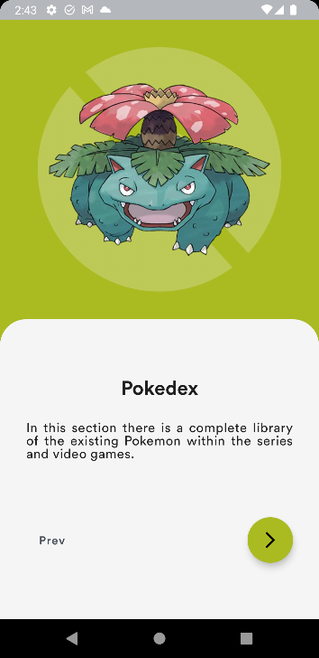
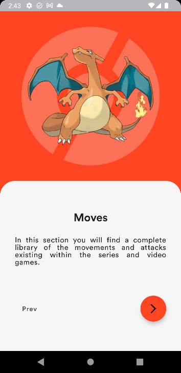
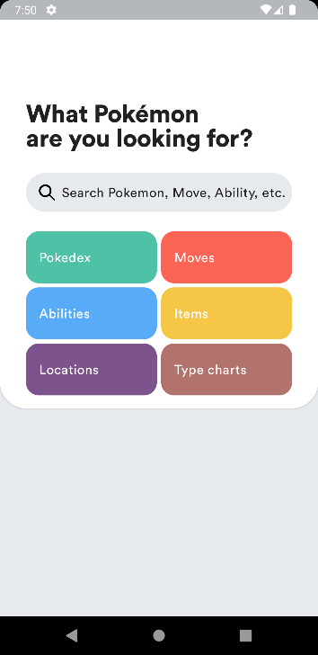
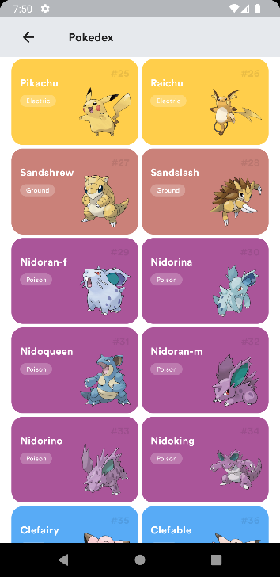
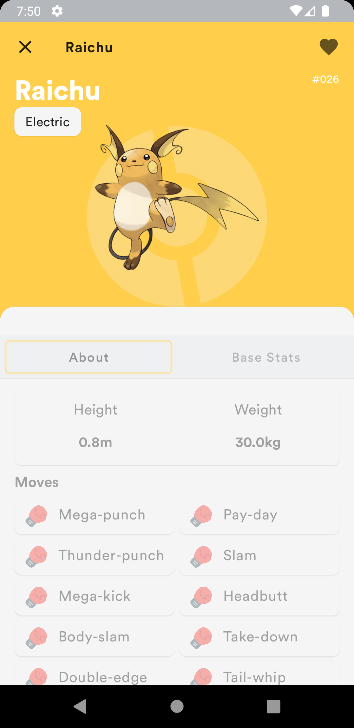
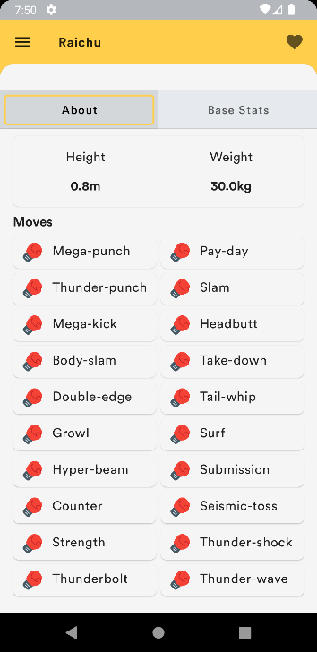
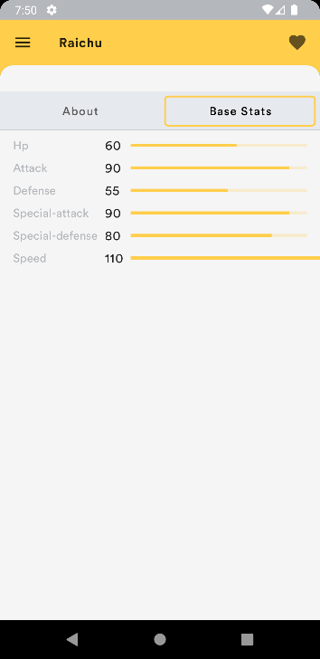
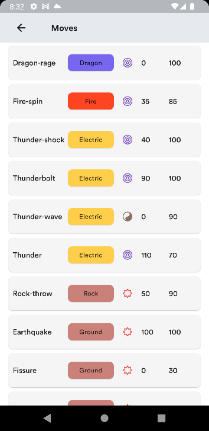

# Pokemon Jetpack Compose

Esta aplicación esta desarrollada en Android Studio con Jetpack Compose.
Tambien dentro de ella se realiza el consumo de la PokéApi la cual nos brinda la información de la aplicación.

  

### Pre-requisitos 📋

Antes de iniciar a probar la aplicacion, debe instalar las herramientas necesarias para poder utiñizar el proyecto de Android en nuestro dispositivo de computo.
#### Paso 1.
Debemos instalar nuestra herramienta de desarrollo movil y en este casi vamos a usar Android Studio la cual es el IDE oficial para el desarrollo movil para la plataforma de Android.
Dicha herramienta la vamos a poder encontrar dentro de la pagina oficial de <a href="https://developer.android.com/studio?hl=es-419&gclsrc=ds&gclsrc=ds">Android Studio</a>.
#### Paso 2.
Una vez instalada nuestra herramienta Android Studio debemos crear un emulador para poder previsualizar nuestra aplicacion en accion. Igual podemos utilizar un dispositivo fisico.

### Instalación 🔧

Una vez descargado nuestra aplicacion del repositorio nos arrojara un archivo *.zip* dicho archivo podemos descomprimirlo con la herramienta <a href="https://www.winrar.es/descargas">WinRAR</a>.

Una vez descomprimido el archivo podemos abrirlo con nuestro IDE *Android Studio*.
Una vez abierto nuestro IDE seleccionaremos el boton de *Open* para poder navegar en nuestros documentos y así encontrar el archivo.

Una vez encontrado el archivo en nuestra computadora daremos clic en *Ok* para así de esta manera abra el IDE con nuestro proyecto.

Una vez sincronizado nuestro proyecto debemos obtener esta pantalla:

## Ejecutando la aplicación

Al ejecutar nuestra aplicación lo primero que veremos será las paginas correspondientes al OnboardingScreen

  
  

Una vez lanzadas todas las Screens correpondientes al Onboarding nos va a direccionar al HomeScreen

  

Al dar clic sobre el botón de Pokédex vamos a ingresar al listado de Pokemon:

  

poder
Una vez lanzado nuestro listado vamos a seleccionar un Pokemon para poder entrar a sus detalles:

  

Al dar clic sobre nuestro BackdropScaffold vamos a poder acceder a mas detalles del pokemon como bien lo puede ser:

  
  

Al volver a nuestro menu principal podemos acceder al siguiente apartado el cual lleva por nombre "Moves" y podremos ver la siguiente pantalla

  
  

## Tech Stack 🛠️

* [Android Studio](https://developer.android.com/studio?hl=es-419&gclsrc=ds&gclsrc=ds) - El IDE utilizado
* MVVM
* Room
* Material Design
* Coroutines
* Retrofit
* Coil
* Constraint Layout
* Navigation
* SharedPreferences

## Autor ✒️

* **Jonatan Morales** - *Estudiante de Ingenieria En Tecnologias De Informacion Y Comunicaciones* - [Jonatan Arturo Morales Tavera](https://www.linkedin.com/in/jonatan-arturo-morales-tavera-3b825b240/)

## Licencia 📄

Este proyecto está bajo la Licencia (Tu Licencia) - mira el archivo [LICENSE.md](LICENSE.md) para detalles

## Expresiones de Gratitud 🎁

* Comenta a otros sobre este proyecto 📢
